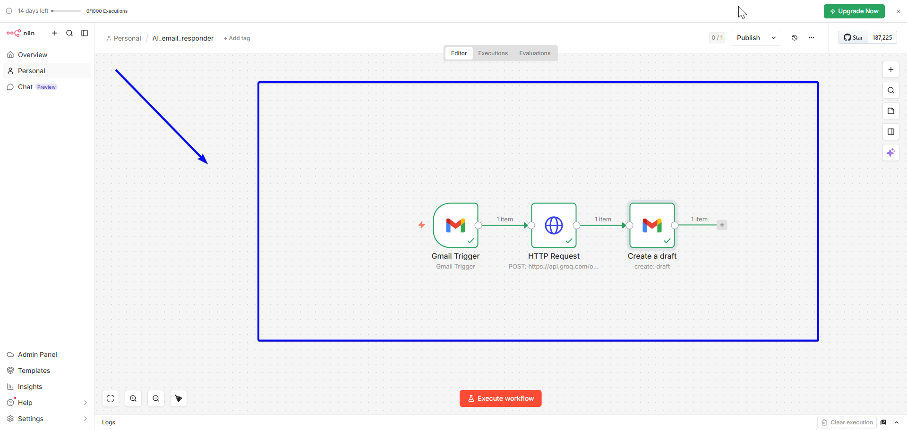

# 🤖 AI Email Responder — n8n + Groq LLM API

An intelligent email automation workflow that reads incoming Gmail messages, sends the content to an LLM API (Groq/Llama 3), generates a professional reply, and saves it directly to Gmail Drafts — ready to review and send with one click.

---

## 🔍 Problem It Solves

Writing professional email replies takes time — especially when you receive high volumes of messages daily. This workflow:

- Eliminates the blank page problem — a ready-to-send draft is waiting every time
- Ensures consistent, professional tone in every reply
- Saves 5–15 minutes per email response
- Works 24/7 even when you're away from your inbox

---

## ⚙️ How It Works

```
Gmail Trigger → HTTP Request (Groq LLM API) → Gmail (save as draft)
```

1. **Gmail Trigger** — monitors inbox continuously for new incoming emails
2. **HTTP Request Node** — sends the email content to Groq's LLM API (Llama 3.3 70B model)
3. **AI Processing** — the model reads the email and generates a concise, professional reply signed with your name
4. **Gmail Draft Node** — saves the AI-generated reply as a draft in Gmail, pre-filled with the recipient's address and subject line

---

## 🛠️ Tools & Integrations

| Tool | Purpose |
|------|---------|
| n8n | Workflow automation engine |
| Gmail API | Email trigger and draft creation |
| Groq API | LLM inference (Llama 3.3 70B model) |
| Llama 3.3 70B | AI model for reply generation |

---

## 📸 Workflow Preview



---

## 🎥 Demo

[▶ Click to watch the demo video](https://youtu.be/3v0XTr2PC84)

---

## 🧠 AI Prompt Used

The system prompt sent to the LLM:

```
You are a professional email assistant. Write a concise, polite and 
professional reply to the email provided. Sign off as Kodjo Hugues Ballo.
```

You can customize this prompt to match your tone, industry, or specific use case.

---

## 🚀 How to Use This Workflow

### Prerequisites

- n8n account (free at [n8n.io](https://n8n.io))
- Gmail account
- Groq API key (free at [console.groq.com](https://console.groq.com))

### Setup Steps

**1. Get your Groq API Key**
- Go to [console.groq.com](https://console.groq.com)
- Sign up free with Google
- Click **"API Keys"** → **"Create API Key"**
- Copy and save the key

**2. Import the workflow**
- Download `workflow.json` from this repo
- In n8n, go to **Workflows** → **Import from file**
- Select `workflow.json`

**3. Connect your credentials**
- **Gmail Trigger node** → add Google OAuth2 credential
- **HTTP Request node** → paste your Groq API key in the Authorization header
- **Gmail Draft node** → use same Google OAuth2 credential

**4. Configure the HTTP Request node**

| Field | Value |
|---|---|
| Method | POST |
| URL | `https://api.groq.com/openai/v1/chat/completions` |
| Header: Content-Type | `application/json` |
| Header: Authorization | `Bearer YOUR_GROQ_API_KEY` |

**5. JSON Body**

```json
{
  "model": "llama-3.3-70b-versatile",
  "messages": [
    {
      "role": "system",
      "content": "You are a professional email assistant. Write a concise, polite and professional reply to the email provided. Sign off as Kodjo Hugues Ballo."
    },
    {
      "role": "user",
      "content": "Please write a reply to this email: {{ $json.snippet }}"
    }
  ],
  "max_tokens": 500
}
```

**6. Configure the Gmail Draft node**

| Field | Expression |
|---|---|
| To | `{{ $('Gmail Trigger').item.json.from }}` |
| Subject | `Re: {{ $('Gmail Trigger').item.json.subject }}` |
| Message | `{{ $json.choices[0].message.content }}` |

**7. Activate**
- Toggle the workflow **ON**
- Send yourself a test email
- Check Gmail Drafts — an AI-generated reply should appear instantly ✅

---

## 📁 Files

```
├── workflow.json          # n8n workflow export (import directly into n8n)
├── workflow-preview.png   # Screenshot of the n8n canvas
└── README.md              # This file
```

---

## 💡 Possible Extensions

- Filter emails by sender or subject before generating a reply
- Add a confidence score — only draft replies for emails above a certain complexity
- Connect to Slack to notify you when a new draft is ready
- Use a more specific system prompt per email category (support, sales, HR)
- Log all AI-generated drafts to a Google Sheet for review
- Integrate with CRM to pull client context before generating the reply
- Add a human approval step before sending

---

## 👤 Author

**Kodjo Hugues Ballo**
IT Support & Automation Specialist | Python | Active Directory | n8n | LLM Integration

- 🔗 [Upwork Profile](https://www.upwork.com/freelancers/~014627f395c6a1484e)
- 💼 [LinkedIn](https://www.linkedin.com/in/kodjo-hugues-ballo-141327158/)
- 🐙 [GitHub](https://github.com/kodjoballo)

---

## 📄 License

MIT — free to use and adapt.
